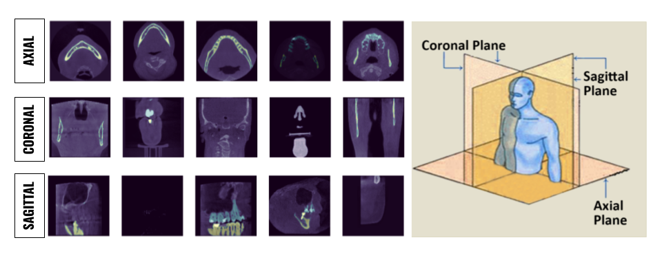

# pytorch-upper-Maxilla-and-lower-Mandible-jaws-segmentation
pytorch segmentation for  upper (Maxilla) and lower(Mandible) jaws in a DICOM file.  The Dataset is provided as 2D slices from all 3 orthogonal points of view Axial, Coronal, and Sagittal.

