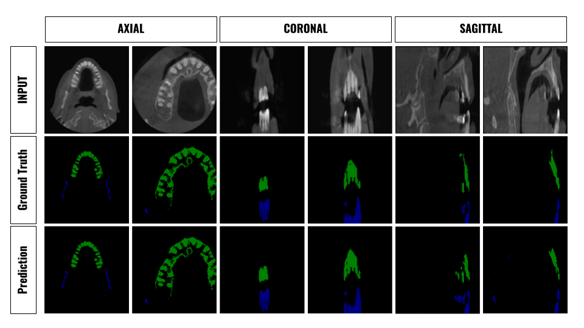

# pytorch-upper-Maxilla-and-lower-Mandible-jaws-segmentation
pytorch segmentation for  upper (Maxilla) and lower(Mandible) jaws in a DICOM file.  The Dataset is provided as 2D slices from all 3 orthogonal points of view Axial, Coronal, and Sagittal.


## Test predictions Sample



---
## Download open source dataset and explore it!
[Download_jaw_segmentation_DS.ipynb](Download_jaw_segmentation_DS.ipynb) contains the required code for download and inspect the dataset.

---
## Install Requirments python >= 3.8
`python3 -m pip install -r requirements.txt`

---
## Repo Structure
All the code for training and testing found under [source/](source/).

.\
├── *`Download_jaw_segmentation_DS.ipynb`* (Download and explore the dataset)\
├── *`LICENSE`*\
├── *`README.md`*\
├── *`requirements.txt`*\
├── **source**\
│   ├── *`baseline.py`* (entry for a single experiment run)\
│   ├── *`experiment_handler.py`* (load multiple experiments configs from [experiments.json](source/experiments.json))\
│   ├── *`experiments.json`* (contains configerations for list of experiement that can be run sequentially)\
│   ├── **helpers**\
│   │   └── *`helpers.py`* (contains helper function used for logging and plotting, etc ...)\
│   ├── **learning**\
│   │   ├── *`dataset.py`* (implement the dataset loaders)\
│   │   ├── *`learner.py`* (implement the training, eval, and test functions)\
│   │   ├── *`losses.py`* (implement multiple loss function)\
│   │   ├── *`model.py`* (implment multiple semantic seg models, currently UNET)\
│   │   └── *`utils.py`* (contains all the utils, reading the configs and get dataset transform functions, get model, etc.)\
│   └── *`option.py`* (contains arguments config if you want to pass them through the terminal instead of a json file)\
└── **view**\
    └── *`Dataset.png`*

---

## Training and baseline

- using *`experiment.json`*
```python
python3 baseline.py --save_path path/to/save/exp/output --model model_name --train_size 128 128 --test_size 128 128 --crop_size --batch_size 8; # other parameters found in [options.py](source/option.py)
```

- using *`terminal`*
    - set the configurations of the experiements in [experiments.json](source/experiments.json), there are 2 main keys, the **`general` config** which have general configurations for all experiments, and **`experiments`** which contains list of experiments config which overwrites the general config based on each experiments customizatiom.

```python
python3 source/experiment_handler.py # after set the configurations
```

---

## supported losses

- Cross Entropy
- Dice Loss
- Focal Loss
- Travesky Loss

---

## supported Models

- UNET

---

## Reference
- [Focal Loss](https://github.com/clcarwin/focal_loss_pytorch)
- [Class Weighted CE Loss](https://github.com/openseg-group/OCNet.pytorch/blob/master/utils/loss.py)
- [EvoNorm](https://github.com/digantamisra98/EvoNorm)
- [StarterCode-@hoya012](https://github.com/hoya012/semantic-segmentation-tutorial-pytorch)